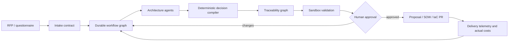

# Agentic Cloud Solution Engineering Factory

**AI solution architecture, RFP automation, Azure cloud migration assessment, Kubernetes platform engineering, Terraform/OpenTofu, FinOps and evidence-backed commercial proposals.**

This project compiles enterprise requirements into a qualified architecture decision, deterministic unit economics, end-to-end requirement traceability and a draft statement of work. It is designed for forward-deployed engineers, cloud architects, MSPs and solution-engineering teams that must move from ambiguous discovery to a reviewable delivery plan quickly.

```text
RFP / discovery contract
        ↓
contract and coverage gates
        ↓
architecture alternatives + weighted decision
        ↓
requirement → component → control → validation → cost → deliverable
        ↓
executive proposal + SOW + tamper-evident receipt
```

> **Evidence boundary:** v0.1 is an executable, deterministic decision compiler operating on synthetic/customer-supplied JSON. It does not deploy cloud resources, discover a live estate, constitute legal/audit advice or prove customer savings. `implemented`, `simulated`, `modeled`, `contract` and `deployed` are deliberately distinct evidence classes.

## Run the reference engagement

No third-party runtime dependency is required.

```bash
python3 -m unittest discover -s tests -v
python3 -m solution_factory.cli examples/vmware-to-azure-ai-platform.json --output generated
python3 -m solution_factory.qualify_cli examples/azure-migration-opportunity.json \
  --output generated/qualification.json
```

The synthetic case evaluates three approaches to a VMware-to-Azure migration with an AKS-hosted AI-agent platform:

1. Azure VMware Solution lift-and-shift;
2. Azure landing zone with AKS modernization;
3. portable Kubernetes across Azure and on-premises.

Generated artifacts:

- `decision.json` — machine-readable qualification, ranking and economics;
- `executive-proposal.md` — decision summary and explicit claim boundary;
- `traceability.md` — every requirement connected to implementation and evidence;
- `statement-of-work.md` — scoped commercial handoff.

Before architecture compilation, `solution-qualify` performs deterministic
pre-bid triage across urgency, budget, decision ownership, deadline, inventory,
success metrics, delivery capacity and commercial fit. It returns `PURSUE`,
`CLARIFY` or `DECLINE` plus the unresolved customer questions. Its score is a
workflow gate, not a prediction of win probability or realized margin.

## What is implemented

- typed requirement intake across business, platform, network, security, operations and commercial discovery;
- must-have coverage rejection before architecture ranking;
- transparent weighted scoring for availability, security, operability and portability;
- deterministic implementation, consumption, operating-cost, payback and ROI calculations;
- evidence-class validation and unsupported-deployment-claim gate;
- complete requirement traceability;
- SHA-256 evidence receipt over the canonical decision;
- proposal, SOW and traceability rendering;
- six automated tests and CI artifact retention.
- evidence-backed pre-bid qualification and customer-question generation;

## Reference decision

The included scenario selects an **Azure landing zone with AKS modernization** because it satisfies every must-have requirement and achieves the highest weighted quality score. Its financial inputs are assumptions—not Azure quotes or customer outcomes—and are intentionally exposed for review.

## Agentic production architecture



LLMs extract and challenge requirements; deterministic code owns eligibility, calculations, evidence classes and publishing gates. The production roadmap integrates LangGraph or Temporal, MCP/A2A adapters, the [Kubernetes AI Agent Operator](https://github.com/AAH20/kubernetes-ai-agent-operator), Terraform/Bicep validation, Infracost, Checkov, OpenTelemetry and signed evidence storage.

## Commercial use cases

- cloud migration and modernization assessments;
- Azure landing-zone and AKS solution design;
- AI platform and NVIDIA NIM capacity proposals;
- regulated hybrid-cloud architecture;
- MSP/MSSP presales qualification;
- disaster-recovery architecture and exercises;
- infrastructure-as-code delivery planning;
- cost optimization and FinOps business cases;
- RFP response automation with source-to-claim traceability.

## KPIs

| Outcome | Definition |
|---|---|
| Time to qualified architecture | Intake accepted to all hard gates evaluated |
| Must-have coverage | Must requirements supported by selected option |
| Traceability completeness | Requirements linked to component, control, test, cost and deliverable |
| Evidence-backed claim rate | Proposal claims with a valid evidence class and reference |
| Estimate variance | Difference between modeled and observed deployment cost |
| Architect review time | Human review effort per qualified proposal |
| Proposal-to-implementation conversion | Accepted proposals becoming delivery engagements |
| Reuse rate | Deliverables fulfilled from versioned, tested modules |
| Gross margin | Engagement revenue less delivery and platform costs |
| Time to verified value | Contract signature to accepted outcome evidence |

## Distribution and compounding leverage

The open-source core is designed for CLI, GitHub Action, MCP server and Backstage-plugin distribution. Industry packs can add requirement taxonomies, validated architecture patterns and pricing inputs without forking the compiler. Completed engagements feed anonymized evaluation cases, decision-quality tests and estimate calibration—subject to consent and data-governance controls.

Commercial extensions can provide collaborative discovery, private deployment, provider-price ingestion, CRM/ERP integration, signed approvals, portfolio analytics and managed operations.

## Repository map

```text
solution_factory/   deterministic compiler and renderers
examples/           synthetic enterprise engagements
tests/              qualification and integrity tests
docs/               architecture, economics and product roadmap
schemas/            machine-readable intake contract
```

## Related systems

- [Kubernetes AI Agent Operator](https://github.com/AAH20/kubernetes-ai-agent-operator) — isolated approval-aware task execution.
- [Multi-Cloud Infrastructure Control Loop](https://github.com/AAH20/multicloud-infrastructure-control-loop) — findings-to-remediation compilation.
- [Network Change Intelligence Twin](https://github.com/AAH20/network-change-intelligence-twin) — network intent and dependency replay.
- [Kubernetes AI FinOps Autopilot](https://github.com/AAH20/kubernetes-ai-finops-autopilot) — GPU and inference economics.

## Call to action

Bring one real RFP or cloud-modernization decision. We can convert it into an assumption-explicit architecture, executable validation plan and commercial delivery baseline. [Request an architecture and unit-economics review](https://a2zsoc.com/contact?topic=solution-engineering-factory&utm_source=github&utm_medium=repository).

## License

Apache-2.0.
